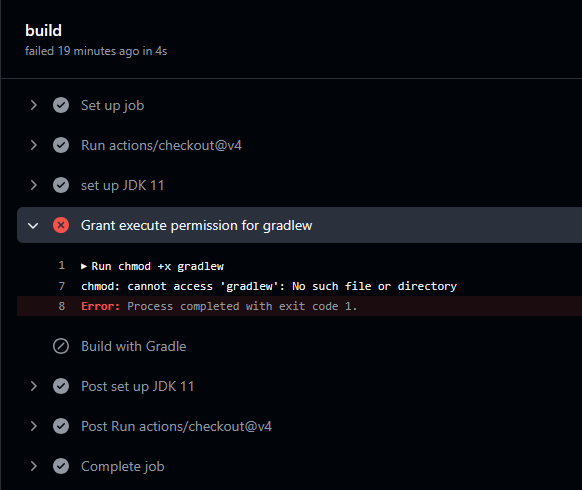

# Lab 08 Instructions

CI/CD is a commonly used industry practice to improve the quality of our software, by continually testing, building, and deploying our code. This increases the stability of our code and allows us to quickly realease new versions, and roll back when there are problems that the test suite catches. More information about CI/CD can be found [here](https://github.com/resources/articles/devops/ci-cd).
    
## Description of Codebase

The codebase contains a basic movie list app similar to lab 5 and lab 7, but the add, edit, and delete functionality has already been implemented for you. In the previous labs, database operations are implemented inside the `MainActivity` class. This is not a good practice, so to encourage good software engineering practices, we separate all database operations into a class called `MovieProvider`. You can view `MovieProvider.java` file and confirm all the functionalities are implemented there. We enourage you to follow this pattern in your team project.

There is also an existing suite of tests. This test suite includes intent tests similar to your lab 7 exercise, under `androidTest/MainActivityTest.java`, and the tests for the `MovieProvider` class that you will be implementing as this lab exercise under `test/MovieProviderTest.java`. We will then set up CI/CD to run these tests automatically.

## Instructions

### 1: Install Firebase CLI, and set up Firebase project
Similar to lab 7, you will need to install [Firebase CLI](https://firebase.google.com/docs/cli), set up a Firebase project, and also create an emulated Firestore database on your console. Here's a quick todo list for you in case you need a refresher:

1. Install Firebase CLI, make sure to add Java to PATH
2. Create a new Firebase project, and download the `google-services.json` file to the `app/` directory
3. Create a Firestore database on the console
4. Run `firebase login` to log in if needed, then run `firebase init` in the `code` directory. Select Firestore emulator similar to lab 7, and let the CLI generates the necessary config files for you.
5. Run `firebase emulators:start` to start the Firestore emulator.
6. After you have completed the above steps, for good luck, you can run the tests `MainActivityTest.java`. They should all pass, but if they don't, you may have to figure out what went wrong. Make sure to update the `tearDown()` function in the test with your project ID, just like in lab 7.
7. Commit and push the added files to your remote repository.

### 2: Set up CI/CD with GitHub Actions for JUnt Tests
In the repository that you cloned, the config file for Github Actions should be under `.github/workflows/`. This file will contain information about:

1. When the workflow should run - this is defined in the `on:` portion of the file
2. Which jobs to run - this file wile only have a build job
3. Configuration for each job, and the steps to run

While you can definitely write your own `.yml` file, Github conveniently provides a template for you. Go to your repository on `github.com`, then click on the `Actions` tab and click on `New workflow` on the left. Here you can see many template workflows for many different languages and frameworks. Feel free to scroll down and explore the different options.

For this lab, you will be using the `Android CI` template. It should show up under the `Suggested for this repository` section, however if it does not, you can search for it in the search bar. Next, click on `Configure`, which will lead you too a `.yml` editor. You should see the following content in the yml file

```yml
name: Android CI

on:
  push:
    branches: [ "main" ]
  pull_request:
    branches: [ "main" ]

jobs:
  build:

    runs-on: ubuntu-latest

    steps:
    - uses: actions/checkout@v4
    - name: set up JDK 11
      uses: actions/setup-java@v4
      with:
        java-version: '11'
        distribution: 'temurin'
        cache: gradle

    - name: Grant execute permission for gradlew
      run: chmod +x gradlew
    - name: Build with Gradle
      run: ./gradlew build
```
### 3: Take a closer look at the `.yml` file
Let's examine the yml file above section by section.

```yml
name: Android CI
```

This is the name of the workflow. In this case, it is `Android CI`, but you can change it to whatever name you like for better readability.

```yml
on:
  push:
    branches: [ "main" ]
  pull_request:
    branches: [ "main" ]
```
This workflow will run on the event of a push to the `main` branch, and also on PR to `main`. If you want this workflow to run on other branches, you can simply add them to the `branches` array.

```yml
jobs:
  build:
    runs-on: ubuntu-latest

    steps:
    - uses: actions/checkout@v4
    - name: set up JDK 11
      uses: actions/setup-java@v4
      with:
        java-version: '11'
        distribution: 'temurin'
        cache: gradle
```
The `jobs` section contains all the jobs that should run in this workflow. Currently, there is only one job named `build`. This `build` job runs on the latest version of Ubuntu, and will execute the following steps:

1. `- uses: actions/checkout@v4` - This step uses the `actions/checkout` action to check out your repository's code. This is essential because the workflow needs access to the code to build it.
2. The next step is to set up JDK 11. Here we can set the name of a step with `- name: [insert name]` for better readability. This step uses the `actions/setup-java` action to set up JDK 11. The `with` section specifies the version of Java to use, and the distribution. The `cache` option is used to cache the Gradle dependencies to speed up the build process.

```yml
    - name: Grant execute permission for gradlew
      run: chmod +x gradlew
    - name: Build with Gradle
      run: ./gradlew build
```
We then grant execute permission to the `gradlew` file, and then build the project with Gradle. The `run` keyword is used to run a command in the shell.

You can now go ahead and add this `android.yml` to your repository by clicking the green `Commit changes..` button on the right of the page. Clicking on the `Actions` tab will show you the status of your newly added workflow. Give it a few seconds, then you should see it fail. Go ahead and inspect why it fails, which should say



### 4: Fix the build
The build failed because it couldn't find the file `gradlew`. This is because our Android project is in the `code` directory, and the `code/gradlew` file is not in the root directory of the repo. You can confirm this by navigating to the `code` directory and make sure the `gradlew` file is there.

To fix this, we need to make sure our working directory is `./code` before running the `gradlew`. We can do this by adding the `working-directory` key to the `run` command. 

We also need to upgrade our java version, let's choose 21 in this case. 

The updated `android.yml` file should look like this:

```yml
name: Android CI

on:
  push:
    branches: [ "main" ]
  pull_request:
    branches: [ "main" ]

jobs:
    build:
    
        runs-on: ubuntu-latest
    
        steps:
        - uses: actions/checkout@v4
        - name: set up JDK 21
        uses: actions/setup-java@v4
        with:
            java-version: '21'
            distribution: 'temurin'
            cache: gradle
    
        - name: Grant execute permission for gradlew
          run: chmod +x gradlew
          working-directory: code
        - name: Build with Gradle
          run: ./gradlew build
          working-directory: code
```

Check your build on the `Actions` tab again. It should work now. 

So, at this point, you have a build job that is working. Let's add a test job called `mock-tests` for our tests in the `MovieProviderTest.java` file.
Try to do this on your own, but if you get stuck, this is what the job should look like:

```yml
  unit-tests:
    runs-on: ubuntu-latest
    steps:
      - uses: actions/checkout@v4
      - name: Run tests
        working-directory: ./code
        run: ./gradlew test
```
We also have instrumented tests in `androidTest/MainActivityTest.java`. To add these tests to the workflow, similarly you can create a new job. However, this time, you have to make sure the emulated database is running before running the tests. To do so, we first install the CLI via `npm install -g firebase-tools`. After that, we can run `firebase emulators:start --only firestore` to start the Firestore emulator. No need for `firebase init` this time, since we already committed the config files to the repo earlier.

```yml
  instrumented-tests:
    runs-on: ubuntu-latest
    steps:
      - name: checkout
        uses: actions/checkout@v4 # Similar to above, check out your code to run

      - name: Enable KVM  
        # Enable KVM for the emulator. 
        # Refer to https://github.com/ReactiveCircus/android-emulator-runner to understand why
        run: |
          echo 'KERNEL=="kvm", GROUP="kvm", MODE="0666", OPTIONS+="static_node=kvm"' | sudo tee /etc/udev/rules.d/99-kvm4all.rules
          sudo udevadm control --reload-rules
          sudo udevadm trigger --name-match=kvm
      
      - name: Setup node # So that we have access to npm
        uses: actions/setup-node@v4
      
      - name: Install and Run Firebase
        run: npm install -g firebase-tools
      
      - name: Start Emulator
        run: firebase emulators:start --only firestore &
        working-directory: code
      
      - name: run tests
        uses: reactivecircus/android-emulator-runner@v2
        with:
          api-level: 29
          script: ./gradlew connectedCheck
          working-directory: code
```

This is what your final `android.yml` file should look like:

```yml
name: Android CI

on:
  push:
    branches: [ "main" ]
  pull_request:
    branches: [ "main" ]

jobs:
  build:
    runs-on: ubuntu-latest

    steps:
    - uses: actions/checkout@v4
    - name: set up JDK 21
      uses: actions/setup-java@v4
      with:
          java-version: '21'
          distribution: 'temurin'
          cache: gradle

    - name: Grant execute permission for gradlew
      run: chmod +x gradlew
      working-directory: code
    - name: Build with Gradle
      run: ./gradlew build
      working-directory: code

  unit-tests:
    runs-on: ubuntu-latest
    steps:
      - uses: actions/checkout@v4
      - name: Run tests
        working-directory: ./code
        run: ./gradlew test
  
  instrumented-tests:
    runs-on: ubuntu-latest
    steps:
      - name: checkout
        uses: actions/checkout@v4 # Similar to above, check out your code to run

      - name: Enable KVM  
        run: |
          echo 'KERNEL=="kvm", GROUP="kvm", MODE="0666", OPTIONS+="static_node=kvm"' | sudo tee /etc/udev/rules.d/99-kvm4all.rules
          sudo udevadm control --reload-rules
          sudo udevadm trigger --name-match=kvm
      
      - name: Setup node
        uses: actions/setup-node@v4
      
      - name: Install and Run Firebase
        run: npm install -g firebase-tools
      
      - name: Start Emulator
        run: firebase emulators:start --only firestore &
        working-directory: code

      - name: run tests
        uses: reactivecircus/android-emulator-runner@v2
        with:
          api-level: 29
          script: ./gradlew connectedCheck
          working-directory: code

```

Make sure the workflow runs successfully.


### 5: Are you Mocking Me?

Last week, we looked at setting up an emulated database to use for our testing. This week, we will look at mocking, which is another way we can handle our database, or any external service, during testing. With mocking, instead of setting a temporary test database to use, instead we will change, or "mock" calls to our database to some other behaviour we define, instead of actually calling our database. We can also set the values these mock calls will return, instead of what they would actually return. This allows us to test our code without having to interact with our database at all.

To get started with our test mocking, we need to add the following lines to our app gradle file:

```kts
    testImplementation("org.mockito:mockito-core:5.7.0")
    testImplementation("org.mockito:mockito-inline:5.2.0")
    implementation("net.bytebuddy:byte-buddy:1.17.1")
```

This has already been done in the code you have been given, but if you want to use it in your project (which you should), you will have to add them.

Next, under the `com.example.androidci(test)` folder, we will create a new test file `MovieProviderTest`. To get started with our test, we will need to mock out our firestore instance, the reference to our `movies` collection, and any references to documents in our `movies` collection. This can be done by declaring a class variable for each of these items, and annotating them with the `@Mock` decorator.

```java
public class MovieProviderTest {
    @Mock
    private FirebaseFirestore mockFirestore;

    @Mock
    private CollectionReference mockMovieCollection;

    @Mock
    private DocumentReference mockDocRef;

    private MovieProvider movieProvider;
}
```

This will replace these items with a mocked version, but we need stilll need to define the behaviour of these objects. We can do this in a setup method using the `@Before` decorator, which we saw last week.

```java
@Before
public void setUp() {
    // Start up mocks
    MockitoAnnotations.openMocks(this);
    // Define the behaviour we want during our tests. This part is what avoids the calls to firestore.
    when(mockFirestore.collection("movies")).thenReturn(mockMovieCollection);
    when(mockMovieCollection.document()).thenReturn(mockDocRef);
    when(mockMovieCollection.document(anyString())).thenReturn(mockDocRef);
    // Setup the movie provider
    MovieProvider.setInstanceForTesting(mockFirestore);
    movieProvider = MovieProvider.getInstance(mockFirestore);
}
```

We also need to add one method to our `MovieProvider` class for use in our tests. This is becuase it follows a singleton pattern, but we need to insert a mock for each unit test.

```Java
public static void setInstanceForTesting(FirebaseFirestore firestore) {
    movieProvider = new MovieProvider(firestore);
}
```

Now, we can write a test for adding a movie using the movie provider, without making the call to our database.

```java
@Test
public void testAddMovieSetsId() {
    // Movie to add
    Movie movie = new Movie("Oppenheimer", "Thriller/Historical Drama", 2023);
   
    // Define the ID we want to set for the movie
    when(mockDocRef.getId()).thenReturn("123");

    
    // Add movie and check that we update our movie with the generated id
    movieProvider.addMovie(movie);
    assertEquals("Movie was not updated with correct id.", "123", movie.getId());

    /* 
        Verify that we called the set method. Normally, this would call the database, but due to what we did in our setup method, this will not actually interact with the database, but the mock does track that the method was called.
    */
    verify(mockDocRef).set(movie);
}
```

We can also write a test to check our delete, which should work similarly.

```java
 @Test
 public void testDeleteMovie() {
    // Create movie and set our id
     Movie movie = new Movie("Oppenheimer", "Thriller/Historical Drama", 2023);
     movie.setId("123");

     // Call the delete movie and verify the firebase delete method was called.
     movieProvider.deleteMovie(movie);
     verify(mockDocRef).delete();
 }
```

Our mocked tests can also check if an error is thrown. This can happen in the `MovieProvider.java` class if the provided movie is invalid. Although our front end validates the user input, it's still important to also check the data before an insert to our database. We may have multiple activities interacting with this code, and some may have incorrect or missing validation, so we should always check before putting the data in the database.

```java
@Test(expected = IllegalArgumentException.class)
public void testUpdateMovieShouldThrowErrorForDifferentIds() {
    Movie movie = new Movie("Oppenheimer", "Thriller/Historical Drama", 2023);
    // Set our ID to 1
    movie.setId("1");

    // Make sure the doc ref has a different ID
    when(mockDocRef.getId()).thenReturn("123");

    // Call update movie, which should throw an error
    movieProvider.updateMovie(movie, "Another Title", "Another Genre", 2026);
}

@Test(expected = IllegalArgumentException.class)
public void testUpdateMovieShouldThrowErrorForEmptyName() {
    Movie movie = new Movie("Oppenheimer", "Thriller/Historical Drama", 2023);
    movie.setId("123");
    when(mockDocRef.getId()).thenReturn("123");

    // Call update movie, which should throw an error due to having an empty name
    movieProvider.updateMovie(movie, "", "Another Genre", 2026);
}
```

The first test we add here checls that an error is thrown if we try to update a movie with a different ID then the one we have the document reference for. The second makes sure that the name is not empty before updating the movie.
